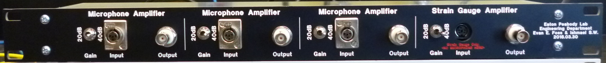
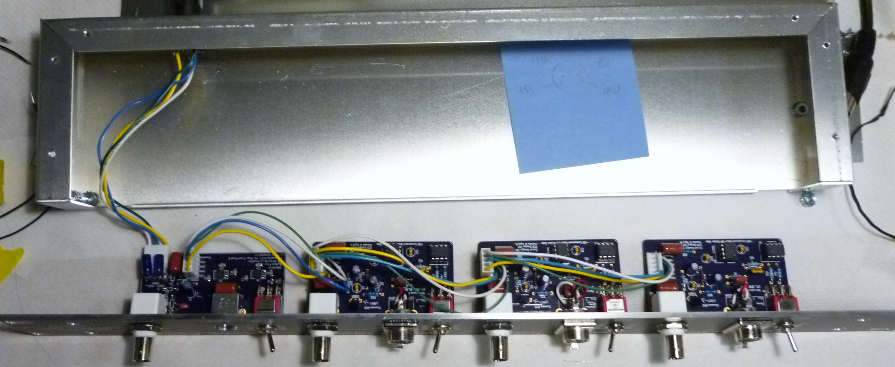

# EPL Lavinia

This was a project for Lavinia Sheets. As it was unlikely to need expansion I designed it to fit in a U1 size package and not a set of subrack modules.

The package includes 

3x EPL Microphone Amplifier (EK Series)
1x EPL Strain Guage Amplifier

The EK series Mic. Amp. was a recent update made by modifying the EPL Microphone Amplifier for the FG Series Mics. The FG mic uses 1.5V bias and the EK series needs 9V. Since this project I have redone the EPL Mic Amp to be better fitted for the <a href="https://github.com/EPL-Engineering/epl_micamp_ek">EK series and that project is here</a>. That said the intended application of this was for use with an accelerometer and <a href="https://github.com/EPL-Engineering/epl_accelerometer">I have since made a device just for that which you can see here</a>. I have not changed or updated the files in this project however so that they match what is in the delivered device.

The included EPL Strain Guage Amplifier was unique to this project but we have no idea how well it actually works because the sensor it was meant to be used with did not work out. The amplifier it self needed another revision to fix an error in the PCB layout but with the sensor type never used it didn't matter.

